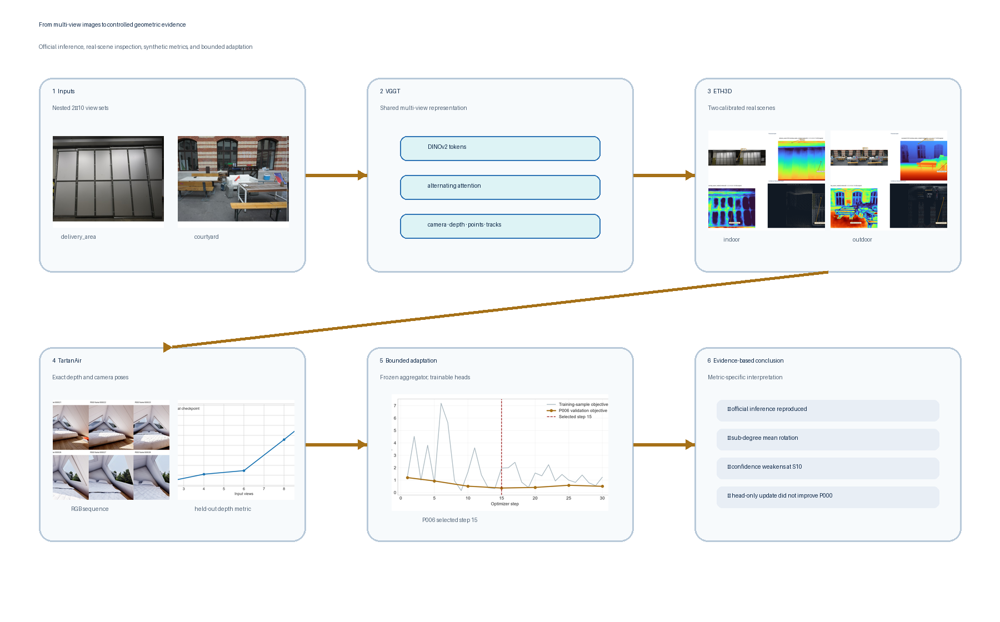
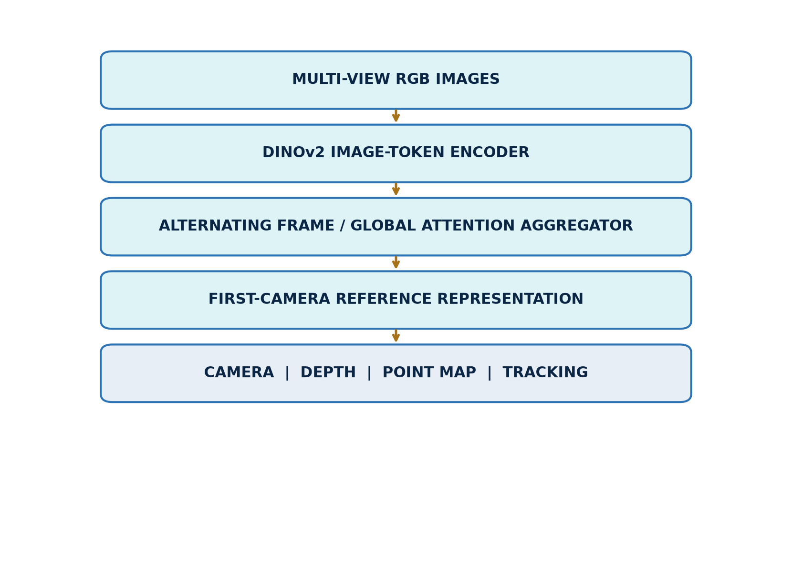
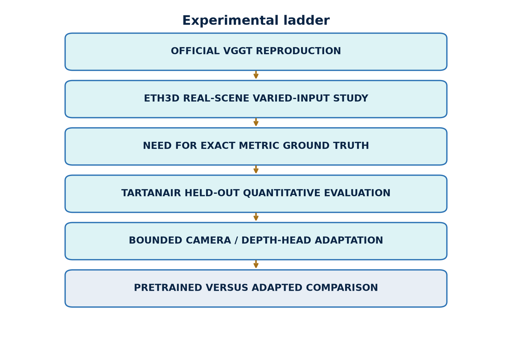
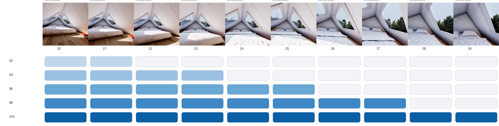
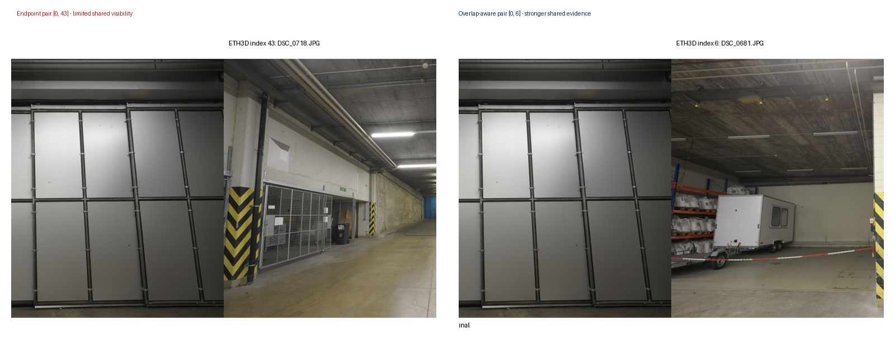
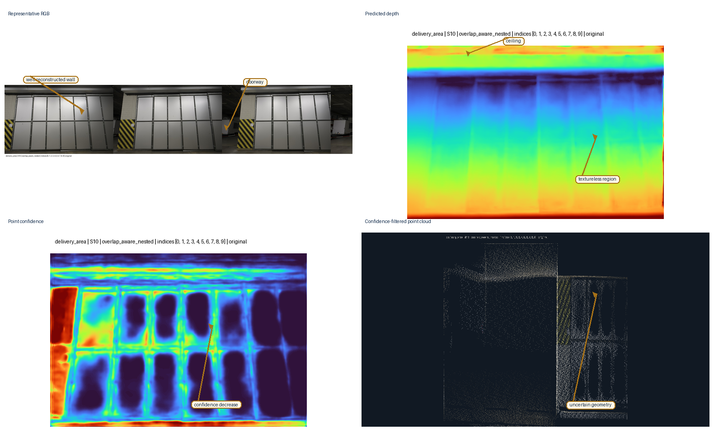
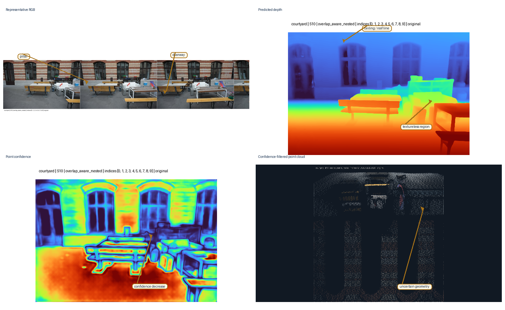
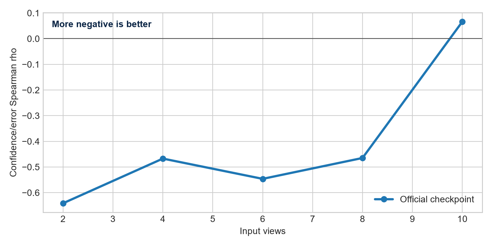
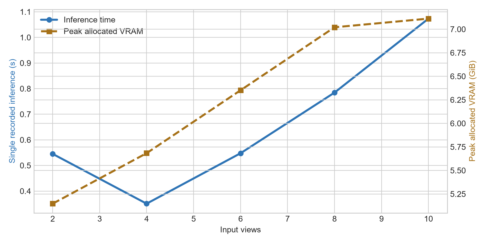
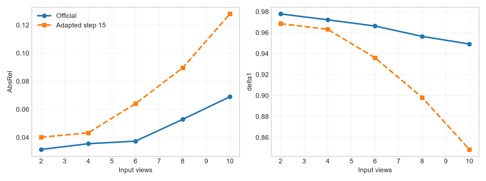

# Final Project
## Seminar in Deep Learning for Solving Computer Vision Problems

# Reproducing and Evaluating VGGT:
## View-Count Scaling, Confidence Calibration, and Bounded Domain Adaptation

**A Controlled Study on ETH3D and TartanAir**

**Peleg Shpitzer**  
**Razi Mreeh**

<!-- PAGE BREAK -->

# Abstract

Visual Geometry Grounded Transformer (VGGT) predicts cameras, depth, point maps, tracks, and confidence directly from one or more images. We reproduced the maintained official VGGT-1B inference path and evaluated what changes when the same scene is presented with 2, 4, 6, 8, or 10 views. The study combines qualitative evidence from two calibrated ETH3D scenes with quantitative evaluation on the synthetic TartanAir environment ArchVizTinyHouseDay. Exact synthetic depth and poses separate camera-orientation quality, scale-aligned depth error, confidence behavior, runtime, and memory. On held-out P000, the official checkpoint reaches depth AbsRel of 0.031 at two views and 0.069 at ten views; mean rotation error remains below 0.77°. Confidence is informative in several conditions but is not consistent as view count grows. We also test bounded adaptation: the transformer aggregator is frozen, camera and depth heads are trained for 30 optimizer steps on P001–P005, and step 15 is selected only through fixed P006 validation pairs. On P000, adaptation lowers RMSE slightly but worsens AbsRel and δ1.25 at every view count. A depth-range diagnostic indicates that the RMSE change is concentrated in large absolute errors at far range while near-range relative error increases. The adaptation is therefore retained as a controlled negative result rather than evidence of general improvement.

## Research questions

**RQ1 — View-count scaling.** How do camera, depth, confidence, runtime, and GPU memory change across nested sets of 2–10 overlapping views?

**RQ2 — Cross-domain behavior.** Which strengths and weaknesses appear across calibrated real imagery and synthetic imagery with dense ground truth?

**RQ3 — Bounded adaptation.** Can a short update of only the camera and depth heads improve held-out synthetic geometry?

## Contributions

1. Code-verified reproduction of official released inference with saved-output numerical validation.
2. A shared view-count ladder across camera, depth, confidence, timing, and memory.
3. Two-scene ETH3D evidence plus quantitative, split-safe TartanAir evaluation.
4. A bounded adaptation experiment whose negative held-out result is preserved.

**Reproduction statement.** Official released inference was reproduced. Locally measured values were recomputed from saved predictions and ground truth. We did not reproduce the original training process or every benchmark table in the paper.

<!-- PAGE BREAK -->

# Main Findings

*Figure 1. The complete study at a glance: varied inputs, shared VGGT inference, real-scene evidence, synthetic metrics, bounded adaptation, and the resulting evidence-based conclusion.*

- **Official implementation reproduced:** the maintained VGGT-1B inference path and required prediction heads ran successfully.
- **Two real scenes evaluated:** delivery_area and courtyard provide complementary indoor and outdoor ETH3D evidence.
- **One quantitative synthetic benchmark:** held-out TartanAir P000 supplies exact camera poses and metric depth.
- **A controlled 2–10 view study:** fixed nested S2/S4/S6/S8/S10 subsets expose view-count behavior without replacing earlier frames.
- **Sub-degree rotation on the selected sequence:** mean rotation error remains below 0.77° across all P000 conditions.
- **Bounded adaptation did not improve held-out performance:** step-15 heads reduce RMSE slightly but worsen AbsRel and δ1.25 at every tested view count.

**One-sentence conclusion.** VGGT produces coherent multi-output geometry on varied inputs, but view-count and confidence behavior require controlled, metric-specific validation; a small head-only update is not sufficient evidence of improved transfer.

<!-- PAGE BREAK -->

# 1. System under study

VGGT accepts a set of RGB images and predicts several geometric quantities in one forward pass. Images are patch-embedded by a DINOv2 encoder, supplemented with register and camera tokens, and processed by alternating frame-wise and global attention. Task heads decode cameras, depth, point maps, and tracking outputs.

*Figure 2. Study-oriented architecture of the maintained VGGT implementation.*

The shared representation is important to this study. Adding images changes the token set seen by the global attention blocks, so view count can affect all output heads simultaneously. This differs from a classical pipeline in which detection, matching, pose estimation, and dense reconstruction are optimized as separate stages.

The VGGT paper reports broad zero-shot geometry capability. Our objective is narrower: characterize local behavior under controlled input changes, exact synthetic ground truth, and one deliberately bounded adaptation. We therefore distinguish full paper reproduction from reproduction of the released inference path.

## Relationship to the Original VGGT Paper

We reproduced the maintained official inference path, checkpoint loading, and principal camera, depth, point, confidence, and tracking outputs. The original paper’s full multi-benchmark evaluation and 64-A100 training process were intentionally outside scope. A bounded reproduction is appropriate for a seminar because it preserves the released model while testing defined behaviors with explicit evidence. Consumer hardware motivated fewer frozen conditions, saved-output verification, and a head-only adaptation probe rather than large-scale retraining.

# 2. Evaluation progression

*Figure 3. Evidence ladder from official inference reproduction to held-out adaptation comparison.*

The evaluation progresses through increasingly strong forms of evidence. Official inference first verifies that the released model and all required output heads operate locally. ETH3D then tests varied real-scene inputs and reveals visible strengths and failure modes. TartanAir adds exact depth and camera poses, enabling quantitative metrics after explicit gauge alignment. Finally, bounded adaptation changes only the camera and depth heads while preserving a separate training, selection, and final-test boundary.

This progression prevents three common errors. A plausible visualization is not treated as metric accuracy. Optimization loss is not treated as held-out improvement. A result on one synthetic environment is not treated as broad domain generalization.

The last rung that could strengthen external validity is an independent synthetic environment. It is documented as a future check rather than silently added to the evidence: no second environment was locally available, and none was downloaded.

<!-- PAGE BREAK -->

# 3. Datasets and split roles

ETH3D is a calibrated multi-view stereo benchmark containing high-resolution imagery and laser-derived ground truth. We use **delivery_area**, an indoor scene with repeated structures and occlusion, and **courtyard**, an outdoor scene with wider depth variation. ETH3D supports qualitative real-scene inspection here; we do not report benchmark accuracy.

TartanAir supplies synthetic RGB sequences with synchronized dense depth and camera poses. The local environment is **ArchVizTinyHouseDay**, difficulty **easy**, front camera. Its trajectories are separated by role before adaptation.

| Dataset / split | Evidence role | Ground truth | Adaptation exposure |
|---|---|---|---|
| ETH3D delivery_area | indoor real-scene evidence | calibration; geometry not scored | none |
| ETH3D courtyard | outdoor real-scene evidence | calibration; geometry not scored | none |
| TartanAir P001–P005 | adaptation training | dense depth and poses | training only |
| TartanAir P006 | checkpoint selection | five fixed adjacent pairs | validation only |
| TartanAir P000 | final quantitative test | dense depth and poses | never used |

P000 is untouched by training, hyperparameter choice, early stopping, and checkpoint selection. P006 selects the saved head state. P001–P005 provide 30 sampled adjacent training pairs.

**Independent-environment boundary.** Only ArchVizTinyHouseDay was present locally. A compatible Office/easy/front check is recommended, but it was neither acquired nor evaluated. The report therefore makes no environment-level generalization claim.

<!-- PAGE BREAK -->

# 4. Exact inputs and overlap-aware protocol

*Figure 4. P000 frames 20–29 form nested S2, S4, S6, S8, and S10 conditions.*

Each larger P000 condition retains every image from the smaller condition and adds two frames. This controls replacement effects, but view count and the identity of the added frames remain partially confounded. There is one fixed subset per count, not repeated random subsets.

*Figure 5. Endpoint and overlap-aware delivery_area pairs.*

ETH3D inputs were selected through pose spacing, visual inspection, and an image-space ORB/RANSAC diagnostic. ORB descriptors are matched with a ratio test; RANSAC retains geometrically consistent correspondences. Match and inlier ratios are proxies for shared image evidence, not exact 3D visibility overlap. Texture, repetition, blur, and detector settings influence them.

The higher-overlap pair provides broader shared content than the endpoint pair. The comparison motivates the nested overlap-aware scene selections while avoiding a claim that an image-space match statistic is ground-truth overlap.

<!-- PAGE BREAK -->

# 5. Camera coordinate convention and gauge

VGGT camera extrinsics use an OpenCV-style world-to-camera mapping:

**x_c = R x_w + t**

Camera centers are recovered by:

**C = −Rᵀt**

Predicted and ground-truth centers occupy different similarity gauges. For every view-count condition, a 7-DoF similarity transform is fitted independently from all matched camera centers using Umeyama alignment:

**Ĉ_i = s Q C_i + b**

The resulting translation ATE is the root mean squared distance between aligned predicted centers and ground-truth centers. With only two centers, a similarity transform can absorb almost all translation discrepancy. S2 translation residuals are therefore degenerate or weakly constrained and are not evidence of translation quality.

Rotation uses a separate first-camera gauge. The orientation transform anchors the first predicted camera to the first ground-truth camera. Each remaining relative rotation is compared after this anchoring, and its geodesic angle is computed from the rotation-matrix trace. Mean rotation error is reported in degrees.

Three alignment choices must remain distinct:

- Umeyama Sim(3) aligns camera centers.
- First-camera orientation anchoring aligns rotations.
- Median scaling aligns depth for evaluation.

None of these operations changes the saved model outputs.

<!-- PAGE BREAK -->

# 6. Depth alignment, metrics, and validation discipline

One global depth scale is estimated jointly over all valid pixels and frames within each view-count condition:

**α = median(d_gt) / median(d_pred), d̂ = α d_pred**

Valid pixels require finite prediction and ground truth, positive predicted depth, and ground-truth depth in 0.1–100 m. Synthetic far-value sentinels are excluded. Scaling is evaluation-only.

## Metric definitions

**AbsRel ↓**  

**AbsRel = (1/N) Σ |d̂_i − d_i| / d_i**  

Unitless relative error; lower is better.

**RMSE (m) ↓**  

**RMSE = √[(1/N) Σ(d̂_i − d_i)²]**  

Metric-depth error in meters; lower is better and large absolute residuals receive more weight.

**δ1.25 ↑**  
Fraction satisfying **max(d̂_i/d_i, d_i/d̂_i) < 1.25**. Higher is better.

**Mean rotation error (°) ↓**  
Mean geodesic angle after first-camera orientation anchoring. Lower is better.

**Spearman ρ**  

**ρ(confidence, absolute depth error)**

More negative is better for this pairing because high confidence should rank lower-error pixels. This is rank association, not probabilistic calibration.

## Validation discipline

Evidence labels distinguish **author-reported** claims, **code-verified** facts, **locally measured** values, and **diagnostic** interpretations without causal proof. P000 metrics were recomputed from saved outputs.

<!-- PAGE BREAK -->

# 7. ETH3D delivery_area

*Figure 6. Annotated delivery_area evidence: representative RGB, predicted depth, point confidence, and confidence-filtered point cloud for the overlap-aware S10 condition.*

The indoor result preserves the scene’s central free space, wall and shelving layout, and major depth ordering. Confidence filtering removes many isolated points while leaving recognizable room structure. The enlarged dark-background point-cloud panel uses the existing confidence-filtered preview with stronger display contrast; geometry and filtering are unchanged.

Weaknesses remain visible around thin structures, occlusion boundaries, repetitive shelving, and low-texture regions. The filtered point cloud is incomplete, and apparent visual coherence does not establish metric accuracy. This page is qualitative evidence of rapid scene-level reconstruction from varied real inputs.

<!-- PAGE BREAK -->

# 8. ETH3D courtyard

*Figure 7. Annotated courtyard evidence: representative RGB, predicted depth, point confidence, and confidence-filtered point cloud for the overlap-aware S10 condition.*

The outdoor result separates foreground architectural surfaces from the deeper courtyard and retains a coherent scene envelope after confidence filtering. Compared with delivery_area, the geometry spans a wider depth range and contains more open regions.

Fine boundaries, vegetation-like texture, distant surfaces, and weakly observed regions remain less stable. The confidence-filtered cloud is useful for inspection but should not be interpreted as a calibrated probability map or an ETH3D benchmark measurement. Together, the two scene pages demonstrate varied real inputs while preserving the boundary between visual evidence and quantitative accuracy.

<!-- PAGE BREAK -->

# 9. TartanAir pretrained baseline

| Views | AbsRel ↓ | RMSE (m) ↓ | δ1.25 ↑ | Rotation (°) ↓ | Conf./error ρ | Time (s) | VRAM (GiB) |
|---:|---:|---:|---:|---:|---:|---:|---:|
| 2 | 0.0314 | 2.183 | 0.9778 | 0.089 | −0.641 | 0.545 | 5.147 |
| 4 | 0.0355 | 2.635 | 0.9722 | 0.361 | −0.467 | 0.351 | 5.683 |
| 6 | 0.0373 | 3.790 | 0.9663 | 0.601 | −0.546 | 0.548 | 6.352 |
| 8 | 0.0529 | 4.458 | 0.9564 | 0.700 | −0.465 | 0.785 | 7.021 |
| 10 | 0.0689 | 4.259 | 0.9491 | 0.767 | +0.066 | 1.073 | 7.112 |

*Table 1. Official checkpoint on held-out P000.*

*Figure 8. Scale-aligned depth AbsRel across the fixed nested subsets.*

Within this trajectory and ordering, depth does not improve monotonically as frames are added. AbsRel rises from 0.0314 at S2 to 0.0689 at S10, while δ1.25 decreases from 0.9778 to 0.9491. Mean rotation error increases but remains below one degree.

Each row is a single fixed nested condition. There are no repeated subsets or uncertainty intervals. The result does not show that two views are generally optimal: cardinality and the identity, overlap, and difficulty of added frames remain partially confounded.

<!-- PAGE BREAK -->

# 10. Confidence, runtime, and memory

*Figure 9. Spearman association between point confidence and absolute depth error. More negative is better.*

At S2, ρ = −0.641, so confidence ranks lower-error pixels reasonably well. The relationship remains negative through S8 but weakens, then changes sign to +0.066 at S10. A threshold selected at one view count could therefore retain a different error population at another. Confidence-filtered clouds may look cleaner without confidence being probabilistically calibrated.

*Figure 10. Single recorded inference time and peak allocated memory.*

Peak allocated memory grows from 5.15 to 7.11 GiB. Runtime is not monotonic at the smallest conditions, where warm-up, kernel selection, and fixed overhead can dominate, but increases from S4 to S10. Each point is one recorded run, so the chart does not provide throughput uncertainty or hardware-independent performance.

<!-- PAGE BREAK -->

# 11. Bounded adaptation

| Configuration item | Recorded setting |
|---|---|
| Total parameters | 1,157,941,492 |
| Frozen aggregator | 909,112,320 parameters; evaluation mode |
| Trainable modules | camera and depth heads; 248,829,172 parameters |
| Optimizer | AdamW; learning rate 1×10⁻⁵; weight decay 0.01 |
| Numerical settings | BF16 autocast; gradient clipping 1.0 |
| Batch and duration | one adjacent two-frame sequence; 30 optimizer steps |
| Training data | sampled adjacent pairs from P001–P005 |
| Validation | five fixed P006 adjacent pairs every five steps |
| Selection | minimum P006 objective; selected step 15 (0.3612) |
| Loss | smooth-L1 camera; confidence-weighted log-depth and log-depth L1 |
| Loss weights | camera 1; depth 1; confidence regularization 0.05 |
| Elapsed time | 25.85 s |
| Memory probe | 5.947 GiB allocated; 6.523 GiB reserved |

*Table 2. Bounded adaptation configuration and resource record.*

*Figure 11. Training-sample and fixed P006 validation objectives.*

The memory measurement is a separate no-update forward/backward probe, not the exact peak of the complete adaptation run. This is bounded domain adaptation on one GPU, not reproduction of the original 64-A100 training process.

The held-out result also suggests a representational limitation of this particular update strategy: adapting only the prediction heads may be insufficient to improve the shared geometric representation learned by the frozen transformer. This is an interpretation of the observed trade-off, not a universal claim about VGGT adaptation. A different parameter subset, loss balance, or data regime would constitute a separate experiment.

<!-- PAGE BREAK -->

# 12. Held-out adaptation result

| Views | Pre AbsRel | Adapt AbsRel | Pre RMSE | Adapt RMSE | Pre δ1.25 | Adapt δ1.25 | Pre ρ | Adapt ρ |
|---:|---:|---:|---:|---:|---:|---:|---:|---:|
| 2 | 0.0314 | 0.0401 | 2.183 | 2.107 | 0.9778 | 0.9686 | −0.641 | −0.167 |
| 4 | 0.0355 | 0.0433 | 2.635 | 2.565 | 0.9722 | 0.9631 | −0.467 | −0.265 |
| 6 | 0.0373 | 0.0640 | 3.790 | 3.677 | 0.9663 | 0.9359 | −0.546 | −0.417 |
| 8 | 0.0529 | 0.0895 | 4.458 | 4.436 | 0.9564 | 0.8981 | −0.465 | −0.364 |
| 10 | 0.0689 | 0.1279 | 4.259 | 4.225 | 0.9491 | 0.8485 | +0.066 | −0.095 |

*Table 3. Official checkpoint and selected step-15 heads on untouched P000.*

*Figure 12. Adaptation slightly lowers RMSE while degrading AbsRel and δ1.25.*

The result depends on the metric. RMSE decreases by 0.03–0.11 m, but AbsRel rises and δ1.25 falls at every subset. At S10, near-range (0.1–5 m) AbsRel changes from 0.0430 to 0.1040, while far-range (20–100 m) RMSE changes from 41.729 to 41.372 m. Because RMSE weights large residuals quadratically, a small reduction in distant absolute errors can outweigh worse near relative error.

This is a plausible diagnostic interpretation, not causal proof. Across the metric set, the adapted heads do not improve held-out P000 geometry.

<!-- PAGE BREAK -->

# 13. Discussion and conclusion

## Observed strengths

- One checkpoint produces multiple geometric outputs on real and synthetic inputs.
- ETH3D preserves coherent indoor and outdoor scene structure.
- Selected smaller P000 subsets reach AbsRel of 0.031–0.037.
- Mean relative rotation error remains below one degree on the selected sequence.
- Tested inference and bounded backpropagation fit the RTX 5080.

## Observed weaknesses

- Geometry is non-monotonic along the fixed nested sequence.
- Confidence/error ranking weakens and changes sign at S10.
- Thin structures, difficult surfaces, and weak overlap remain visually fragile.
- Head-only adaptation over-specializes relative depth behavior.
- One subset per count provides no variance estimate.

## External-validity boundary and limitations

The quantitative result covers one synthetic environment, one held-out trajectory, and one subset per view count. ETH3D evidence is qualitative. Alignment removes absolute scale, S2 translation is weakly constrained, timing lacks repeated trials, and full-run adaptation peak memory was not recorded. No second environment was available.

## Possible Explanations

The following points are **speculative hypotheses**, not established conclusions:

- **Speculative—increased viewpoint diversity.** Added frames may supply useful baselines but different appearance and visibility.
- **Speculative—partial occlusion.** Newly visible or hidden surfaces may complicate joint aggregation.
- **Speculative—attention distribution.** More image tokens may redistribute global attention; no attention maps were inspected.
- **Speculative—redundancy versus complementarity.** Nearby frames may be redundant, while complementary frames also add harder variation.
- **Speculative—confidence limitations.** The S10 sign change may reflect condition-dependent confidence/error association.

These hypotheses motivate randomized subsets and attention or risk–coverage analysis, but they do not alter the measured result.

## Conclusion

Successful official-inference reproduction enabled controlled experiments on real and synthetic inputs. ETH3D shows coherent scene structure and sensitivity to difficult regions; TartanAir reveals non-monotonic view-count behavior, weakening confidence/error association, and sub-degree mean rotation on the selected sequence. Bounded head-only adaptation is feasible but does not improve held-out performance across the metric set, so the negative result remains part of the evidence. Learned visual geometry should be judged through controlled inputs, explicit alignment, and complementary metrics—not qualitative visualization alone.

# References

1. J. Wang, M. Chen, N. Karaev, A. Vedaldi, C. Rupprecht, and D. Novotny. “VGGT: Visual Geometry Grounded Transformer.” *Proceedings of the IEEE/CVF Conference on Computer Vision and Pattern Recognition*, pp. 5294–5306, 2025.

2. T. Schöps, J. L. Schönberger, S. Galliani, T. Sattler, K. Schindler, M. Pollefeys, and A. Geiger. “A Multi-View Stereo Benchmark with High-Resolution Images and Multi-Camera Videos.” *CVPR*, 2017.

3. W. Wang, D. Zhu, X. Wang, Y. Hu, Y. Qiu, C. Wang, Y. Hu, A. Kapoor, and S. Scherer. “TartanAir: A Dataset to Push the Limits of Visual SLAM.” *IROS*, 2020.

4. M. Oquab et al. “DINOv2: Learning Robust Visual Features without Supervision.” *Transactions on Machine Learning Research*, 2024.

5. E. Rublee, V. Rabaud, K. Konolige, and G. Bradski. “ORB: An Efficient Alternative to SIFT or SURF.” *ICCV*, pp. 2564–2571, 2011.

6. M. A. Fischler and R. C. Bolles. “Random Sample Consensus: A Paradigm for Model Fitting with Applications to Image Analysis and Automated Cartography.” *Communications of the ACM*, 24(6), pp. 381–395, 1981.

7. S. Umeyama. “Least-Squares Estimation of Transformation Parameters Between Two Point Patterns.” *IEEE TPAMI*, 13(4), pp. 376–380, 1991.

8. Facebook Research. “VGGT official repository.” https://github.com/facebookresearch/vggt. Accessed July 2026.

9. TartanAir. “Official documentation and data distribution.” https://theairlab.org/tartanair-dataset/ and https://huggingface.co/datasets/theairlabcmu/tartanair2. Accessed July 2026.

## Reproducibility record

Official repository revision **a288dd0f14786c93483e45524328726ab7b1b4ce**; VGGT-1B checkpoint revision **860abec7937da0a4c03c41d3c269c366e82abdf9**, SHA-256 **d15bf50a8615c8225ed48b51ea5cac673d82442ec0309036df555a053253afe0**. Canonical metrics were recomputed from saved outputs. P006 selected step 15, and the recorded selected head-state hash is retained in the validation artifacts. Report generation performed no inference, training, or dataset acquisition. Artifact locations are repository-relative.
