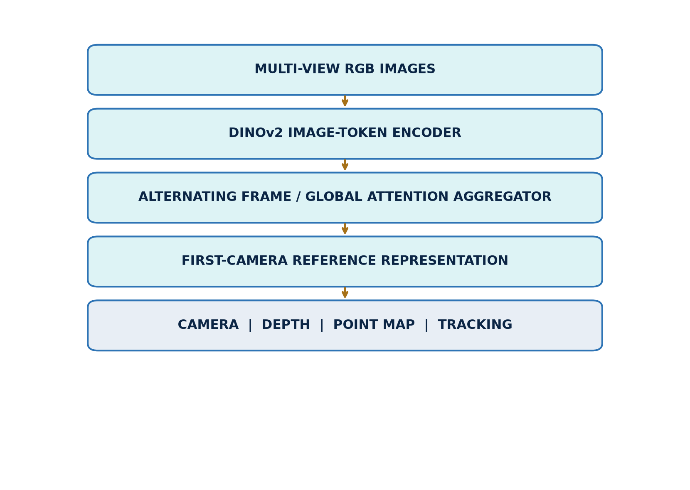
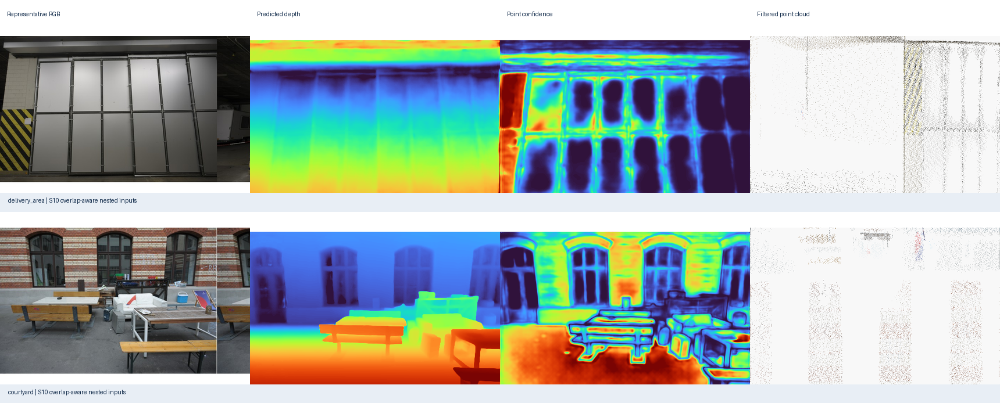
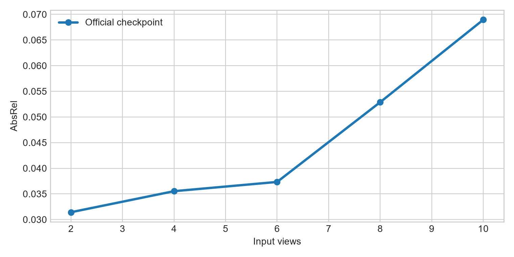
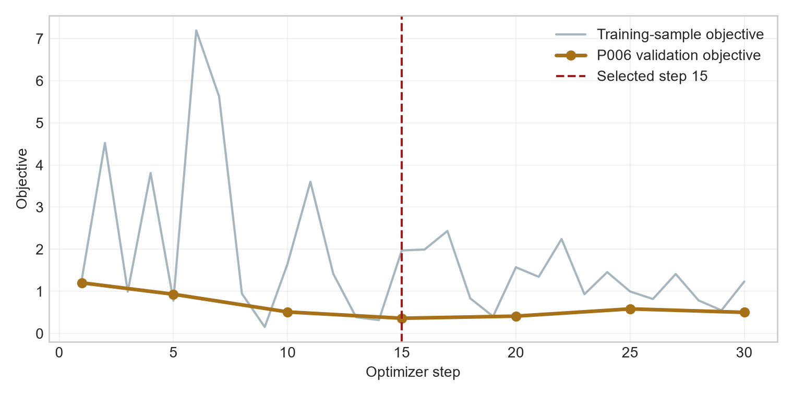

# Reproducing and Evaluating VGGT:
## View-Count Scaling, Confidence Calibration, and Bounded Domain Adaptation

**A controlled study on ETH3D and TartanAir**

**Peleg Shpitzer · Razi Mreeh**  
University of Haifa  
Course: [course name] · Instructor: [instructor name]

<!-- PAGE BREAK -->

# Abstract

Visual Geometry Grounded Transformer (VGGT) predicts cameras, depth, point maps, and tracks directly from one or more images. We reproduce the maintained official VGGT-1B inference path and evaluate what changes when the same scene is presented with 2, 4, 6, 8, or 10 views. The study combines qualitative evidence from two calibrated ETH3D scenes with quantitative evaluation on the synthetic TartanAir environment ArchVizTinyHouseDay. Exact synthetic depth and poses make it possible to separate camera-orientation quality, scale-aligned depth error, confidence calibration, runtime, and memory. On the held-out P000 trajectory, the official checkpoint reaches depth AbsRel of 0.031 at two views and 0.069 at ten views; mean rotation error remains below 0.77°. Confidence is useful in several conditions but is not consistently calibrated as view count grows. We also test a deliberately bounded adaptation: the transformer aggregator is frozen, camera and depth heads are trained for 30 optimizer steps on P001–P005, and step 15 is selected only by fixed P006 validation pairs. On P000 this adaptation lowers RMSE slightly but worsens AbsRel and δ<1.25 at every tested view count. A depth-range diagnostic indicates that the RMSE change is concentrated in large absolute errors at far range, while near-range relative error increases. The result demonstrates feasibility on an RTX 5080, but not improved held-out accuracy. The report therefore treats the adaptation as a controlled negative result and emphasizes leakage-safe evaluation, metric-specific interpretation, and honest limits on generalization.

# 1. Research questions and contributions

This study asks three questions:

**RQ1 — View-count scaling.** How do camera, depth, confidence, runtime, and GPU memory change when VGGT receives increasingly large, nested sets of overlapping views?

**RQ2 — Cross-domain strengths and weaknesses.** Which properties remain reliable across calibrated real imagery and synthetic imagery with dense ground truth, and where do the outputs or metrics expose failure modes?

**RQ3 — Bounded adaptation.** Can a short, leakage-safe update of only the camera and depth heads improve held-out synthetic geometry without retraining the 1B-parameter backbone?

The work contributes: (1) a code-verified reproduction of official inference with saved-output validation; (2) a controlled view-count ladder shared across camera, depth, confidence, timing, and memory measurements; (3) qualitative ETH3D evidence from indoor and outdoor scenes, including a low-overlap comparison; (4) a quantitative TartanAir protocol with explicit gauge alignment and validity masks; and (5) a bounded adaptation experiment whose negative held-out result is preserved rather than hidden.

**Reproduction statement.** All reported local measurements were produced by the official VGGT-1B checkpoint through the repository’s wrapped inference path. The numerical tables in this report were independently recomputed from saved predictions and ground truth. Author-reported claims from the VGGT paper are identified as background; they are not presented as our measurements.

<!-- PAGE BREAK -->

# 2. System under study

VGGT accepts an unordered or weakly ordered set of RGB images and produces multiple geometric quantities in a single forward pass. Images are patch-embedded, augmented with camera and register tokens, and processed by alternating frame-wise and global transformer attention. Task-specific heads then decode camera parameters, depth, point maps, tracks, and confidence. This design differs from a classical structure-from-motion pipeline: feature extraction, cross-view reasoning, and prediction are learned jointly rather than assembled as independently optimized stages.

*Figure 1. Study-oriented VGGT architecture. The input is explicitly multi-view RGB imagery; the diagram separates the shared transformer from task heads and the outputs used in this evaluation.*

The paper reports broad zero-shot geometry capability and strong benchmark results. Our narrower question is behavioral: under fixed local conditions, which outputs are stable as more views are supplied, how informative is confidence, and what happens under a small domain-specific update? We do not compare against all paper benchmarks and therefore do not claim full paper reproduction.

*Figure 2. Evidence ladder. Each successive block adds information or intervention while maintaining held-out boundaries.*

The ladder prevents qualitative examples, exact-ground-truth evaluation, and adaptation from being conflated. ETH3D establishes visible real-scene behavior. TartanAir adds metric ground truth. The adaptation changes trainable parameters but retains a distinct selection trajectory and a never-trained test trajectory. A second independent environment would be the proper next test of environment-level transfer; it was not locally available and was not downloaded for this report.

<!-- PAGE BREAK -->

# 3. Data and controlled inputs

## 3.1 ETH3D real scenes

ETH3D is a multi-view stereo benchmark containing calibrated imagery and laser-derived ground truth for high-resolution scenes. We use two locally available examples: **delivery_area**, an indoor scene with repeated structures and occlusion, and **courtyard**, an outdoor scene with wider depth variation. Their role here is qualitative and diagnostic. The shown depth, point confidence, and point clouds are VGGT outputs; the figures do not constitute an ETH3D benchmark score.

For each scene we select ordered, overlapping images and build nested view sets. “Nested” means that S2 is contained in S4, S4 in S6, and so on. Consequently, changes are attributable to adding images rather than replacing the earlier subset. A separate low-overlap pair is selected to stress matching and shared visibility.

## 3.2 TartanAir synthetic trajectories

TartanAir supplies photorealistic synthetic sequences with synchronized RGB, dense depth, and camera poses. The locally available environment is **ArchVizTinyHouseDay**, difficulty **easy**, front camera, trajectories P000–P006. P000 is held out for final evaluation; P001–P005 provide adaptation samples; P006 provides fixed validation pairs used for checkpoint selection.

| Dataset / split | Local role | Inputs | Ground truth | Use in adaptation |
|---|---|---|---|---|
| ETH3D delivery_area | real indoor evidence | calibrated RGB views | calibration; benchmark geometry not scored here | none |
| ETH3D courtyard | real outdoor evidence | calibrated RGB views | calibration; benchmark geometry not scored here | none |
| TartanAir P001–P005 | adaptation train | adjacent front-camera RGB pairs | dense depth and poses | training only |
| TartanAir P006 | model selection | five fixed adjacent pairs | dense depth and poses | validation only |
| TartanAir P000 | final test | nested S2/S4/S6/S8/S10 | dense depth and poses | never used |

*Figure 3. Exact nested P000 construction. Each larger condition retains every image from the smaller condition and adds two frames.*

The P000 image indices are fixed by the saved run manifest: S2 uses the first two selected frames, S4 adds the next two, and the sequence continues through S10. This design yields a within-trajectory scaling study rather than ten independent random samples. It improves comparability but limits statistical breadth: neighboring frames are correlated, and each view count represents one specific nested subset.

<!-- PAGE BREAK -->

# 4. Overlap, alignment, and metrics

## 4.1 Pair-overlap diagnostic

We quantify pair overlap using ORB keypoints and descriptors, brute-force Hamming matching with a ratio test, and geometric verification with RANSAC. For images \(I_i,I_j\), let \(K_i,K_j\) be detected keypoints, \(M_{ij}\) ratio-test matches, and \(H_{ij}\subset M_{ij}\) the RANSAC inliers. The diagnostic reports:

\[
r_{\mathrm{match}}=\frac{|M_{ij}|}{\min(|K_i|,|K_j|)},\qquad
r_{\mathrm{inlier}}=\frac{|H_{ij}|}{\max(1,|M_{ij}|)}.
\]

These are image-based proxies, not exact 3D visibility overlap. Texture, repetitive patterns, motion blur, and detector settings can change them. They are therefore used to label relatively higher- and lower-overlap pairs, not to assert a universal overlap percentage.

*Figure 4. Higher- and lower-overlap ETH3D pairs. Match lines are a reproducible image-space diagnostic; they are not ground-truth correspondence labels.*

## 4.2 Camera gauge alignment

VGGT camera extrinsics use an OpenCV-style world-to-camera mapping \(x_c=Rx_w+t\). Camera centers are recovered as

\[
C=-R^\top t.
\]

Predicted and ground-truth centers have different similarity gauges. For each evaluated view-count condition, a 7-DoF similarity transform \((s,Q,b)\) is estimated independently from all matched centers using Umeyama alignment:

\[
\hat C_i=sQC_i+b.
\]

Translation ATE is the root mean squared distance between \(\hat C_i\) and ground-truth centers. With only two centers, similarity alignment can make translation residuals degenerate; S2 ATE is retained for pipeline completeness but should not be interpreted as evidence of translation quality.

Camera rotation uses a separately stated first-camera orientation gauge rather than the Umeyama center rotation. Define \(A=R^{gt}_0(R^{pred}_0)^\top\). For camera \(i\),

\[
\Delta R_i=(R^{gt}_i)^\top A R^{pred}_i,\qquad
e_{R,i}=\cos^{-1}\left(\mathrm{clip}\left(\frac{\mathrm{tr}(\Delta R_i)-1}{2},-1,1\right)\right).
\]

The report gives the mean of \(e_{R,i}\) in degrees. This evaluates relative orientation consistency after anchoring the first camera.

## 4.3 Depth alignment and masks

Monocular/multi-view depth can have an arbitrary global scale. Within each condition, one scalar is computed jointly across all valid pixels and frames:

\[
\alpha=\frac{\mathrm{median}(d^{gt})}{\mathrm{median}(d^{pred})},\qquad \hat d=\alpha d^{pred}.
\]

A pixel is valid only when prediction and ground truth are finite, predicted depth is positive, and ground-truth depth lies in \([0.1,100]\) m. TartanAir’s far-value sentinel is thereby excluded. The scale factor is an evaluation alignment, not a training target.

<!-- PAGE BREAK -->

# 5. Quantitative protocol

Depth metrics over \(N\) valid pixels are:

\[
\mathrm{AbsRel}=\frac1N\sum_i\frac{|\hat d_i-d_i|}{d_i},
\quad
\mathrm{RMSE}=\sqrt{\frac1N\sum_i(\hat d_i-d_i)^2},
\]

\[
\delta_{1.25}=\frac1N\sum_i
\mathbf{1}\!\left[\max\!\left(\frac{\hat d_i}{d_i},\frac{d_i}{\hat d_i}\right)<1.25\right].
\]

Lower AbsRel and RMSE are better; higher \(\delta_{1.25}\) is better. RMSE is measured in meters and emphasizes large absolute errors, whereas AbsRel normalizes by ground-truth depth and is sensitive to relative errors at near range.

Confidence calibration is summarized by Spearman rank correlation \(\rho\) between predicted point confidence and absolute depth error. A more negative value is desirable because higher confidence should rank pixels with lower error. A value near zero indicates weak monotonic ordering; the metric does not assert probabilistic calibration.

Runtime is the measured forward-pass wall time for the saved local run. Peak GPU memory is the maximum allocated CUDA memory recorded for the condition. These values describe the local RTX 5080 software and hardware configuration and should not be treated as hardware-independent throughput.

## 5.1 Validation discipline

Before report generation, the evaluation equations were rerun over the saved P000 predictions and ground truth. The recomputed AbsRel, RMSE, \(\delta_{1.25}\), and confidence correlation agree with the canonical CSVs within numerical tolerance. Provenance checks also confirm that P000 is isolated from adaptation, P006 selected step 15, and every adapted evaluation references the same selected head-state hash.

This distinction matters:

- **Author-reported:** statements taken from the VGGT paper or official documentation.
- **Code-verified:** architecture, tensor conventions, configuration, and provenance inspected in code or artifacts.
- **Locally measured:** metrics produced by the recorded runs.
- **Diagnostic inference:** explanations suggested by additional analysis, but not established causally.

<!-- PAGE BREAK -->

# 6. ETH3D: real-scene evidence

*Figure 5. VGGT outputs for delivery_area and courtyard: RGB reference, predicted depth, predicted point confidence, and confidence-filtered point cloud. These are qualitative outputs, not benchmark accuracy measurements.*

Both scenes produce coherent scene-scale depth ordering and recognizable confidence-filtered structure from RGB inputs. The indoor result retains walls, shelving, and a traversable central volume; the outdoor result separates near architectural surfaces from the deeper courtyard. Confidence filtering removes many unstable points and makes the dominant structure easier to inspect.

The evidence also shows limitations. Thin objects and boundaries produce less stable geometry, low-texture or reflective regions have weaker confidence, and the point cloud is incomplete after filtering. A visually plausible cloud is not proof of metric correctness: camera or scale errors may remain hidden in a favorable viewpoint. The low-overlap comparison further illustrates that limited shared content reduces the number and spatial coverage of verified correspondences, which can weaken any multi-view method’s geometric constraints.

These observations answer part of RQ2. VGGT is useful as a rapid scene-level predictor across distinct real settings, and its confidence can support inspection or filtering. However, the output still needs calibrated ground truth for accuracy claims. For that reason, the primary numerical conclusions come from TartanAir rather than from visual assessment alone.

<!-- PAGE BREAK -->

# 7. TartanAir baseline: view-count scaling

| Views | AbsRel ↓ | RMSE m ↓ | δ<1.25 ↑ | Rot. mean ° ↓ | Conf.–error ρ ↓ | Time s | Peak GiB |
|---:|---:|---:|---:|---:|---:|---:|---:|
| 2 | 0.0314 | 2.183 | 0.9778 | 0.089 | -0.641 | 0.545 | 5.147 |
| 4 | 0.0355 | 2.635 | 0.9722 | 0.361 | -0.467 | 0.351 | 5.683 |
| 6 | 0.0373 | 3.790 | 0.9663 | 0.601 | -0.546 | 0.548 | 6.352 |
| 8 | 0.0529 | 4.458 | 0.9564 | 0.700 | -0.465 | 0.785 | 7.021 |
| 10 | 0.0689 | 4.259 | 0.9491 | 0.767 | +0.066 | 1.073 | 7.112 |

*Table 1. Official checkpoint on held-out TartanAir P000. Each row is one fixed nested condition; no uncertainty interval is implied.*

*Figure 6. Scale-aligned P000 depth error across nested view sets.*

Within this particular trajectory and ordering, adding views does not monotonically improve depth. AbsRel rises from 0.0314 at S2 to 0.0689 at S10, and \(\delta_{1.25}\) decreases from 0.9778 to 0.9491. Rotation error also increases, although it remains below one degree. This is a conditional observation, not a general claim that more views are harmful. Larger subsets include frames with different visibility, baselines, and difficulty; a single nested sequence cannot separate view count from the identity of the added frames.

Memory grows from 5.15 to 7.11 GiB as the token set expands. Runtime is not monotonic at the smallest conditions, likely because warm-up, kernel selection, and fixed overhead are large relative to short passes; from S4 onward it rises consistently to 1.07 s at S10. These numbers confirm that the tested conditions fit comfortably within the available GPU memory, but they do not predict performance on other devices.

<!-- PAGE BREAK -->

# 8. Confidence behavior

*Figure 7. Rank association between confidence and absolute depth error. More negative is better.*

At S2, \(\rho=-0.641\): confidence ranks lower-error pixels reasonably well. The relationship remains negative at S4–S8 but weakens, then reaches \(+0.066\) at S10. Thus confidence is not a universally reliable error proxy under the tested scaling path. A threshold chosen on one condition could retain different error populations at another.

This finding refines the qualitative ETH3D observation. Confidence-filtered clouds can be visually cleaner, yet confidence should not automatically be interpreted as a calibrated probability of correctness. For downstream use, threshold selection should be validated on the intended domain and view-count regime. Calibration curves or held-out risk–coverage analysis would be stronger follow-up tools than a single correlation statistic.

RQ1 therefore has a mixed answer. More input views increase compute and memory as expected, while measured geometry and confidence do not improve monotonically on P000. The likely explanation is not “view count alone,” but an interaction among added-frame content, overlap, domain shift, and learned aggregation. Testing randomized subsets at each cardinality would be needed to isolate those factors.

# 9. Bounded adaptation method

The adaptation deliberately limits both capacity and data exposure. The 909,112,320-parameter aggregator is frozen and kept in evaluation mode. Only the camera and depth heads are trainable: 248,829,172 of 1,157,941,492 total parameters. Each optimizer step samples one adjacent two-frame sequence from P001–P005. Thirty AdamW steps are run with learning rate \(10^{-5}\), weight decay 0.01, gradient clipping at 1.0, BF16 autocast, batch size one sequence, and no gradient accumulation.

The objective combines a smooth-L1 camera term with confidence-weighted log-depth and log-depth-L1 terms, equal camera/depth weights, and confidence regularization weight 0.05. Five fixed P006 adjacent pairs are evaluated every five steps. Step 15, with validation objective 0.3612, is selected before P000 evaluation. P000 is never used for training, hyperparameter choice, early stopping, or checkpoint selection.

The 30-step adaptation took 25.85 s. A separate no-update forward/backward probe recorded 5.947 GiB peak allocated and 6.523 GiB peak reserved CUDA memory. The actual complete-training peak was not separately recorded, so the probe must not be described as the run’s exact peak.

*Figure 8. Training-sample objective and fixed P006 validation objective. The selected head state is step 15.*

<!-- PAGE BREAK -->

# 10. Held-out adaptation result

| Views | Pre AbsRel | Adapt AbsRel | Pre RMSE | Adapt RMSE | Pre δ1 | Adapt δ1 | Pre ρ | Adapt ρ |
|---:|---:|---:|---:|---:|---:|---:|---:|---:|
| 2 | 0.0314 | 0.0401 | 2.183 | 2.107 | 0.9778 | 0.9686 | -0.641 | -0.167 |
| 4 | 0.0355 | 0.0433 | 2.635 | 2.565 | 0.9722 | 0.9631 | -0.467 | -0.265 |
| 6 | 0.0373 | 0.0640 | 3.790 | 3.677 | 0.9663 | 0.9359 | -0.546 | -0.417 |
| 8 | 0.0529 | 0.0895 | 4.458 | 4.436 | 0.9564 | 0.8981 | -0.465 | -0.364 |
| 10 | 0.0689 | 0.1279 | 4.259 | 4.225 | 0.9491 | 0.8485 | +0.066 | -0.095 |

*Table 2. Official checkpoint and selected adapted heads on held-out P000.*

*Figure 9. Adaptation reduces RMSE slightly but degrades relative depth metrics at every view count.*

RMSE decreases by 0.03–0.11 m, but AbsRel rises and \(\delta_{1.25}\) falls at every subset; confidence ranking also weakens at S2 and S4. This is not evidence of general improvement.

A saved-output diagnostic clarifies the conflict. At S10, near-range (0.1–5 m) AbsRel changes from 0.0430 to 0.1040, while far-range (20–100 m) RMSE changes from 41.729 to 41.372 m. Quadratic weighting lets a small reduction in distant absolute errors outweigh near relative degradation. This supports a plausible explanation, not causality.

RQ3 is answered narrowly: head-only optimization is feasible locally, but this configuration does not improve held-out P000 across the metric set. The frozen aggregator and small adjacent-pair regime may constrain transfer; alternatives would be new experiments.

<!-- PAGE BREAK -->

# 11. Strengths, weaknesses, and external-validity boundary

## Strengths observed

- One checkpoint yields multiple geometric outputs on real and synthetic inputs.
- P000 rotation stays below one degree; S2–S6 AbsRel is 0.031–0.037.
- Confidence aids filtering; tested inference and backpropagation fit the GPU.

## Weaknesses observed

- Geometry and confidence are non-monotonic; confidence ranking can approach zero.
- Difficult surfaces, weak overlap, and thin structures remain fragile.
- Adaptation trades slightly lower RMSE for worse relative accuracy.
- One subset per cardinality provides no variance estimate.

## Recommended independent-environment check

Only ArchVizTinyHouseDay was present locally. No second environment was acquired and **zero new VGGT forward passes** were executed. The official distribution lists **Office / Data_easy / front camera** as a suitable, modality-compatible follow-up; front RGB and depth total about 3.704 GB compressed. A future check should compare the official checkpoint and selected step-15 heads on exactly one fixed S2, S6, and S10 subset. No environment-level generalization claim is made.

# 12. Limitations

The test contains one synthetic environment, one trajectory, and one subset per cardinality. Alignment removes absolute scale, S2 translation ATE is underconstrained, runtime lacks repeated-trial uncertainty, and full-run adaptation peak memory was not logged. ETH3D is qualitative. The small adaptation search does not rule out other schedules or trainable subsets. Depth-range analysis diagnoses the same held-out outputs and is not an independent confirmation set.

<!-- PAGE BREAK -->

# 13. Conclusions

The official VGGT implementation was reproduced on real and synthetic inputs. On P000, resource use grows with view count but geometry and confidence do not improve monotonically. ETH3D outputs are coherent at scene scale, with visible weaknesses under difficult surfaces and overlap. Bounded adaptation is feasible but does not improve the held-out result across the metric set.

A lower RMSE can coexist with worse relative accuracy, cleaner filtering with weak calibration, and successful optimization with worse held-out behavior. These distinctions make the negative result useful and motivate a fixed three-pass check in a second environment.

# Author contributions

Both authors jointly designed the study and interpreted the results. **[Confirmed contribution split for Peleg.] [Confirmed contribution split for Razi.]** Both authors reviewed and approved the report.

The bracketed contribution split is the only report content pending author confirmation.

# References

1. J. Wang, M. Chen, N. Karaev, A. Vedaldi, C. Rupprecht, and D. Novotny, “VGGT: Visual Geometry Grounded Transformer,” *Proceedings of the IEEE/CVF Conference on Computer Vision and Pattern Recognition (CVPR)*, pp. 5294–5306, 2025.
2. T. Schöps, J. L. Schönberger, S. Galliani, T. Sattler, K. Schindler, M. Pollefeys, and A. Geiger, “A Multi-View Stereo Benchmark with High-Resolution Images and Multi-Camera Videos,” *CVPR*, 2017.
3. W. Wang, D. Zhu, X. Wang, Y. Hu, Y. Qiu, C. Wang, Y. Hu, A. Kapoor, and S. Scherer, “TartanAir: A Dataset to Push the Limits of Visual SLAM,” *IEEE/RSJ International Conference on Intelligent Robots and Systems (IROS)*, 2020.
4. M. Oquab et al., “DINOv2: Learning Robust Visual Features without Supervision,” *Transactions on Machine Learning Research*, 2024.
5. E. Rublee, V. Rabaud, K. Konolige, and G. Bradski, “ORB: An Efficient Alternative to SIFT or SURF,” *IEEE International Conference on Computer Vision*, pp. 2564–2571, 2011.
6. M. A. Fischler and R. C. Bolles, “Random Sample Consensus: A Paradigm for Model Fitting with Applications to Image Analysis and Automated Cartography,” *Communications of the ACM*, vol. 24, no. 6, pp. 381–395, 1981.
7. S. Umeyama, “Least-Squares Estimation of Transformation Parameters Between Two Point Patterns,” *IEEE Transactions on Pattern Analysis and Machine Intelligence*, vol. 13, no. 4, pp. 376–380, 1991.
8. Facebook Research, “VGGT official repository,” https://github.com/facebookresearch/vggt, accessed July 2026.
9. TartanAir, “Official documentation and data distribution,” https://theairlab.org/tartanair-dataset/ and https://huggingface.co/datasets/theairlabcmu/tartanair2, accessed July 2026.

# Reproducibility appendix

The resolved evaluation and adaptation configurations, environment metadata, canonical metrics, selected head hash, and saved-output validation are stored with the project artifacts. The report-generation step reads those immutable outputs and does not load a checkpoint or run inference. Paths are repository-relative. Raw custom inputs and external source code remain unchanged.
