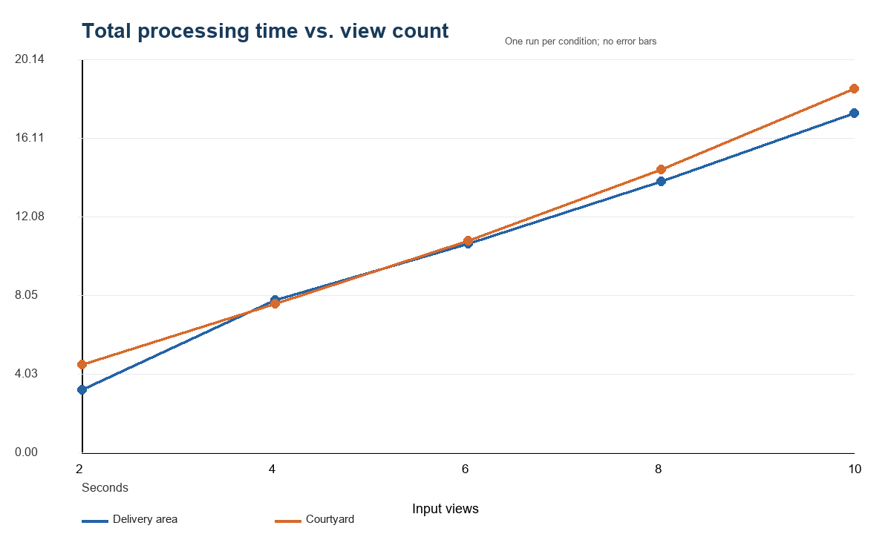
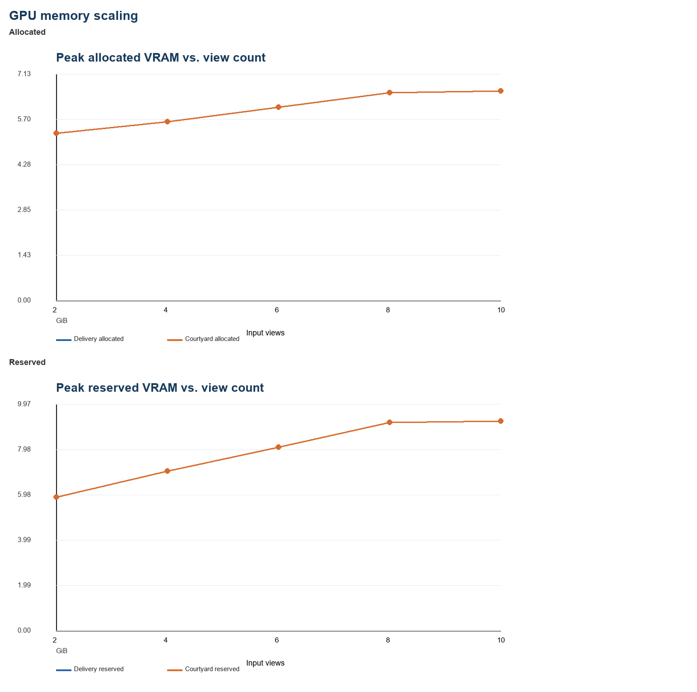
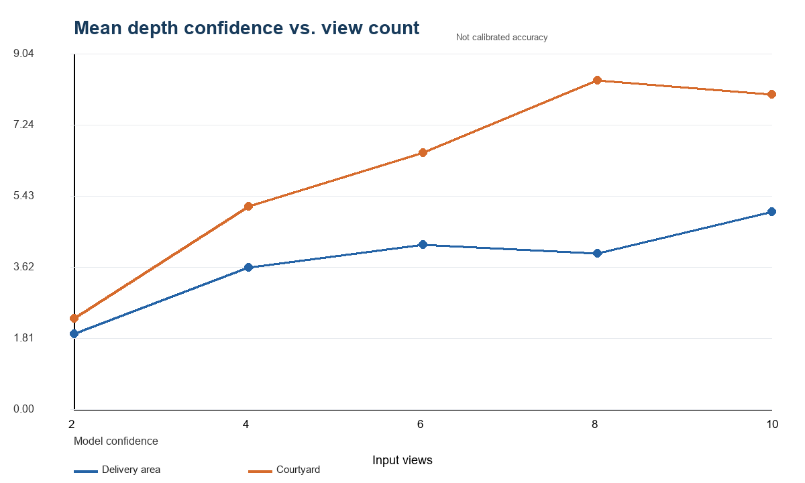
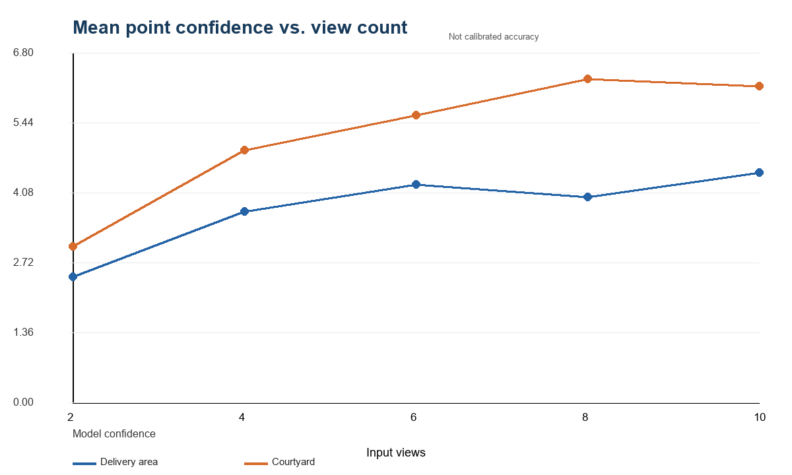
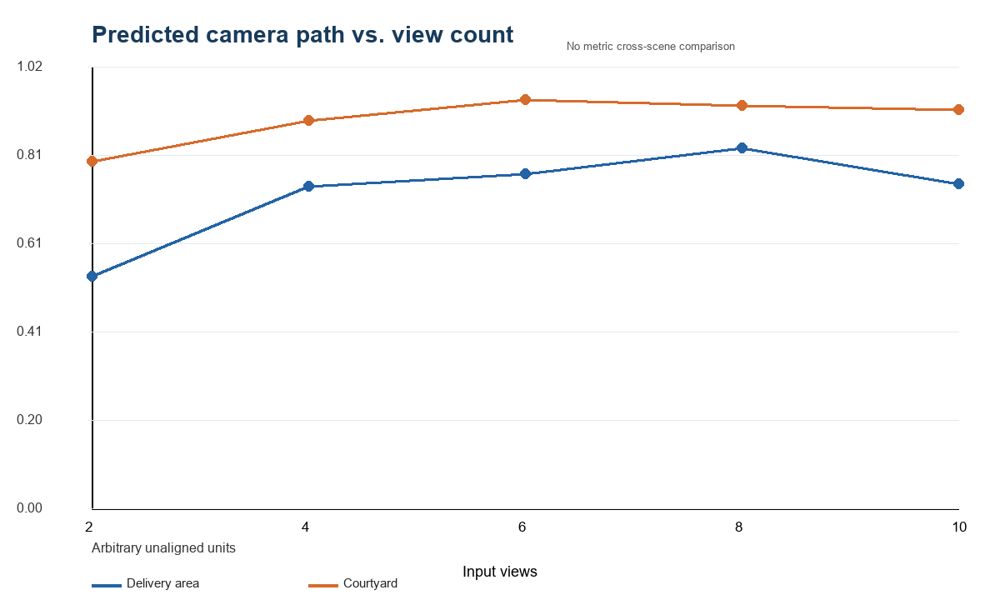
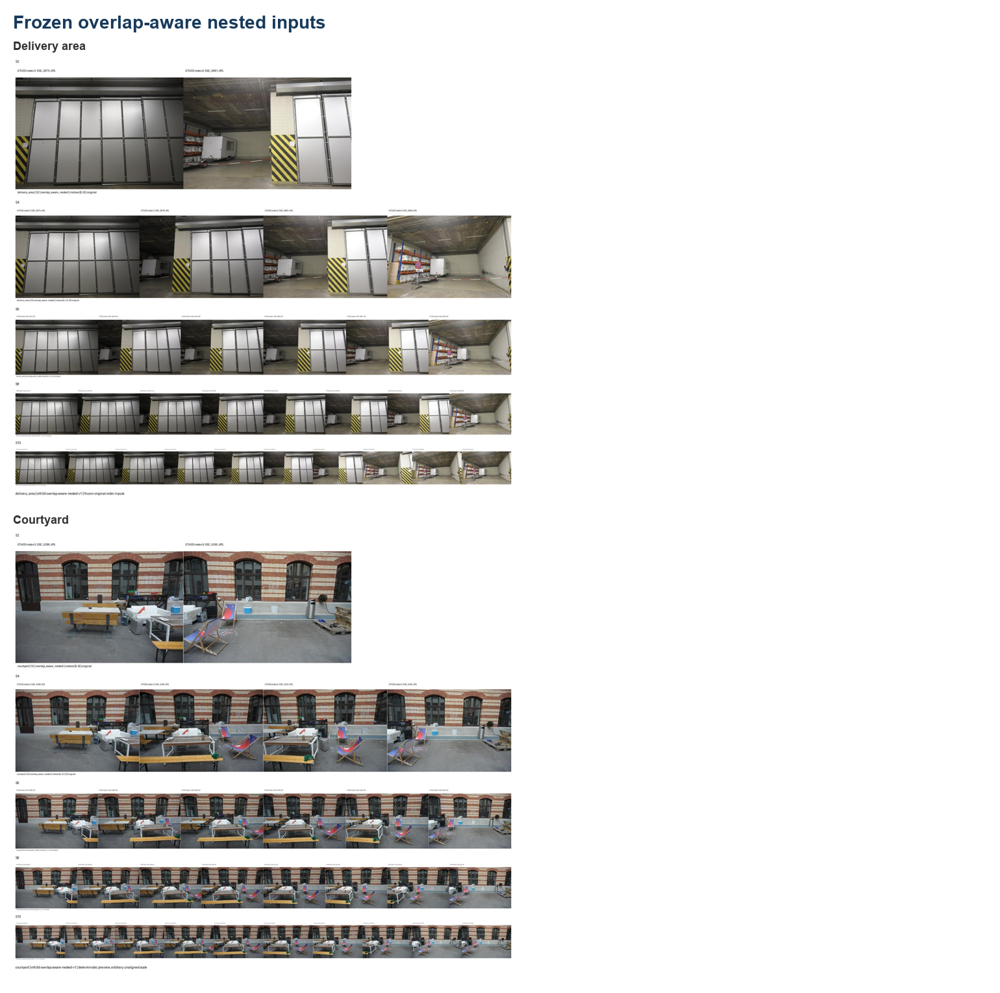
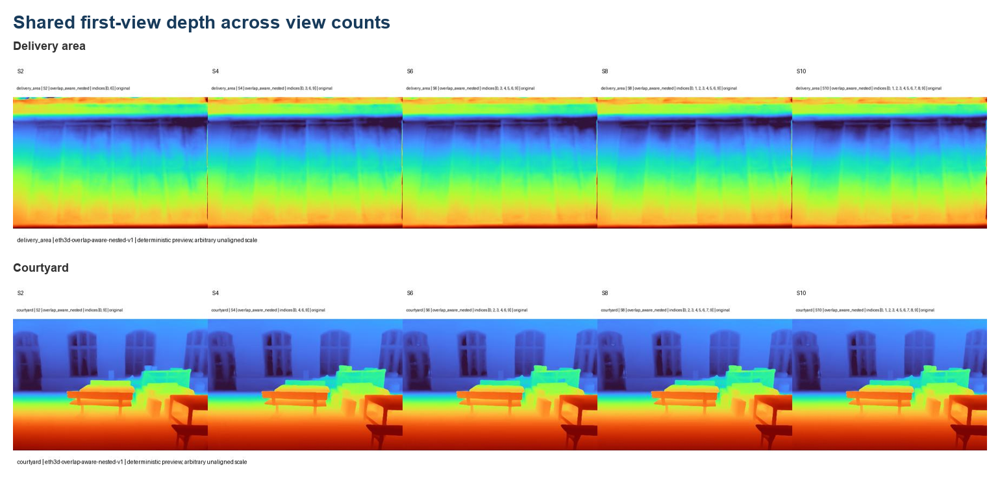
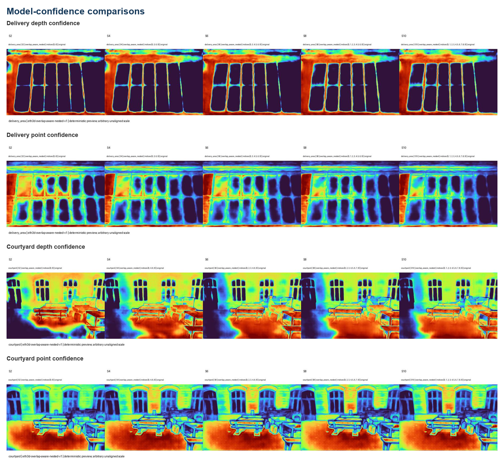
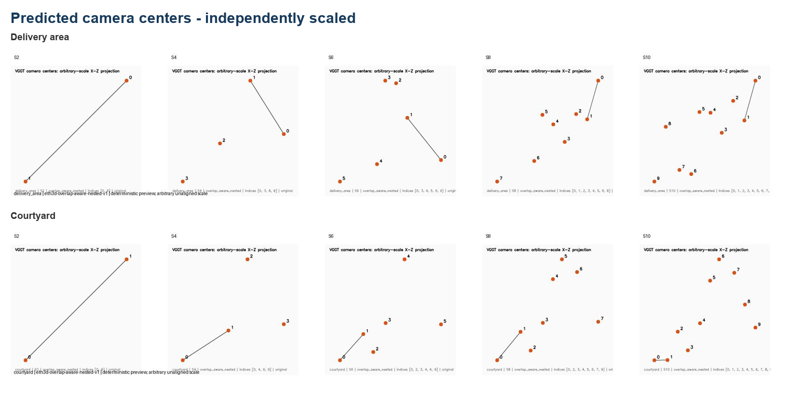
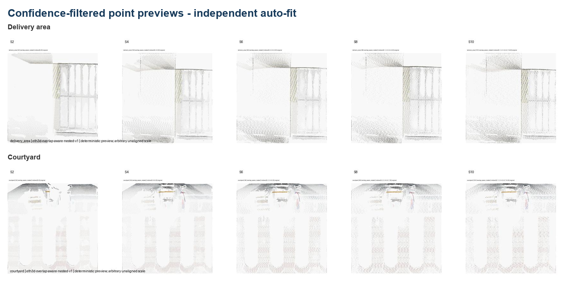

# Reproducing VGGT and Studying View-Count Scaling with Overlap-Aware ETH3D Inputs

**Seminar report draft**  
**Student:** [Student Name]  
**Course / instructor:** [Course / Instructor]  
**Date:** July 2026

## Abstract

Visual Geometry Grounded Transformer (VGGT) predicts cameras, depth, point maps, and tracks from one or more images in a single feed-forward model. This work first reproduced the official inference pipeline locally and then designed a controlled study of how its operational behavior changes with input view count. The maintained official implementation and public VGGT-1B checkpoint were run offline on an NVIDIA GeForce RTX 5080 using BF16 autocast. Two calibrated ETH3D scenes, `delivery_area` and `courtyard`, were studied with 2, 4, 6, 8, and 10 views. A preliminary endpoint pair exposed limited shared content, motivating a deterministic overlap-aware protocol based on camera-center spacing, viewing direction, relative rotation, ORB correspondences, and fundamental-matrix inliers. The resulting nested sets ensured that every larger condition retained all frames from the smaller condition. Across both scenes, peak allocated memory rose from about 5.26 GiB at two views to 6.60 GiB at ten views, while reserved memory approached 9.23 GiB. Synchronized inference stayed near one second, whereas total processing time increased because preprocessing, validation, visualization, and serialization scale with output volume. Model confidence generally increased with additional views but was not monotonic, and qualitative gains appeared to diminish around eight to ten views. Dominant structures remained visually coherent in both scenes. Because outputs were not aligned to ETH3D coordinates, this report makes no reconstruction-accuracy claim. The study demonstrates reproducible operation and a defensible view-count methodology while identifying aligned quantitative evaluation as the main next step.

## 1. Introduction

Multi-view reconstruction traditionally combines feature extraction, correspondence estimation, camera calibration, triangulation, and iterative optimization. VGGT asks whether a single transformer can infer several central geometric representations directly from an unordered-size collection of same-scene RGB images [1]. Its output interface is unusually broad: camera parameters, per-pixel depth and confidence, per-pixel world points and confidence, and point tracks can be produced by one model. This breadth makes VGGT a useful seminar subject, but it also makes evaluation easy to overstate. A successful forward pass is not equivalent to reproducing the paper’s benchmark results, and an attractive point cloud is not evidence of metric accuracy.

This project therefore separates three goals. First, it establishes operational reproduction: the official architecture and public checkpoint can be loaded locally, run offline on consumer hardware, and decoded into the documented output heads. Second, it develops an experimental methodology that changes view count without also changing scene region. Third, it reports operational measurements and qualitative structural observations for two calibrated ETH3D scenes. Quantitative comparison with ETH3D laser scans is deliberately deferred because VGGT predicts in a first-camera reference frame with arbitrary scale; a validated similarity alignment is needed before metric errors are meaningful.

The central experimental question is: **How do runtime, memory, model confidence, predicted camera structure, and visible geometric completeness change as the number of overlapping input views increases from two to ten?** The study uses one run per condition and does not claim statistical significance. Its contribution is a reproducible protocol and a carefully bounded two-scene result, not a new benchmark score.

## 2. Background and Related Work

VGGT is a feed-forward visual geometry model trained to predict several related 3D tasks jointly [1]. Images are tokenized with a DINOv2-based encoder, then processed by an aggregator that alternates frame-local and global attention. Camera tokens feed an iterative camera head, while dense DPT-style decoders produce depth and world-point maps. A query-conditioned tracking head predicts point trajectories and visibility. The model operates from one to many views and expresses predictions relative to the first input camera.

The original paper evaluates camera estimation, multi-view depth, reconstruction, tracking, and downstream uses across multiple datasets [1]. Those author-reported results provide context but are not independently reproduced here. This project instead validates the released inference stack and studies a narrow input factor. ETH3D provides calibrated high-resolution imagery and laser-scan ground truth [2], making it suitable for controlled future evaluation. In the present phase, calibration is used only to define input subsets; scan geometry is not used to score predictions.

Frame selection is a methodological concern in its own right. Uniformly sampling endpoints can maximize temporal span while destroying common visibility. ORB supplies a lightweight, model-independent correspondence signal [3], and RANSAC provides robust geometric verification of tentative matches [4]. Combining these image signals with calibrated camera motion gives a practical proxy for common scene content. None of these proxies is exact geometric overlap, but together they are more defensible than sequence position alone.

## 3. VGGT Architecture Overview

VGGT consumes a tensor of RGB views after official resizing/cropping. The maintained code used in this project produces a camera pose encoding, depth, depth confidence, world points, point confidence, normalized input images, tracks, visibility, and tracking confidence. Pose encodings are decoded into OpenCV-style world-to-camera extrinsics and intrinsics. Depth is also unprojected with predicted cameras, yielding a second point representation alongside the dedicated world-point head.

Alternating attention is central to the model’s multi-view behavior. Frame attention processes image-specific information, while global attention communicates across all view tokens. Increasing view count therefore changes both the number of dense predictions and the amount of cross-view evidence available to the shared representation. It may improve consistency or completeness, but added views can also be redundant or introduce evidence that is less compatible with the existing set. Consequently, monotonic confidence or geometry changes are not guaranteed.

The model’s coordinate system is a critical interpretive boundary. Predicted extrinsics are internally coherent camera-from-world transforms, but the reference frame and scale are model-defined. Camera centers are computed as `C = -R^T t`. Without similarity alignment, path length and separation are arbitrary prediction units. They can describe changes within saved outputs but cannot be read as meters or directly compared with calibrated ETH3D baselines.

## 4. Reproduction Setup

The maintained official repository was pinned at commit `a288dd0f14786c93483e45524328726ab7b1b4ce`. The public `facebook/VGGT-1B` checkpoint, revision `860abec7937da0a4c03c41d3c269c366e82abdf9`, was stored locally as `model.pt`; its SHA-256 is `d15bf50a8615c8225ed48b51ea5cac673d82442ec0309036df555a053253afe0`. Inference used Python 3.11.15, PyTorch 2.13.0+cu130, CUDA 13.0, and an NVIDIA GeForce RTX 5080. BF16 autocast was enabled and Flash scaled-dot-product attention was disabled. All Hugging Face network modes were forced offline, checkpoint loading used explicit local `torch.load(..., weights_only=True, mmap=True)`, and `from_pretrained` was not used.

The installation was inference-only. FlashAttention was not required, and COLMAP was not a runtime dependency for VGGT inference. ETH3D COLMAP-format calibration was parsed by project code. The initial reproduction used the bundled official cartoon example and exercised all output heads in exactly one CUDA forward pass. Architecture initialization took 5.65 seconds, local checkpoint loading 1.58 seconds, GPU transfer 1.09 seconds, preprocessing 0.21 seconds, and synchronized inference 1.59 seconds. Peak allocated and reserved VRAM were about 5.11 and 5.70 GiB. These measurements established operational correctness, not reproduction of the paper’s published benchmark metrics.

The first genuine ETH3D smoke test used `delivery_area` endpoints `[0,43]`. It completed successfully with finite outputs, decoded cameras, and point-cloud exports. However, the contact sheet showed limited common content. That result was retained as a pipeline validation but rejected as the scientific two-view condition.

## 5. Dataset and Scene Selection

ETH3D contains calibrated multi-view imagery with laser scans and evaluation masks [2]. This project acquired only the required high-resolution training assets for two scenes: `delivery_area` and `courtyard`. `delivery_area` contains 44 ordered DSLR images; `courtyard` contains 38. The selected source images are 6208 × 4135 pixels, and both scenes include calibrated camera poses. Lexical filename order matches calibration order for the inspected sequences; timestamps were not available.

The scenes offer complementary content without supporting a broad generalization claim. `delivery_area` is dominated by indoor planes, large doors, a striped pillar, and service-area objects. `courtyard` contains a brick façade, repeated arched windows, furniture, thin structures, and an outdoor ground plane. These differences support a descriptive check across two visual regimes while keeping the study small enough for detailed artifact inspection.

Laser scans were deliberately not used for accuracy measurement. VGGT outputs must first be reconciled with ETH3D coordinate conventions and aligned by an explicitly validated similarity transformation. Computing point-to-scan, depth, or pose error before that step would mix model error with gauge mismatch. Calibration was used here only for ordering and overlap-aware input design.

## 6. Overlap-Aware Nested Frame Protocol

The endpoint smoke test demonstrated why full-sequence uniform sampling was inadequate: `[0,43]` spanned the sequence but showed little obvious shared structure. Multi-view geometry requires common observations, and a view-count experiment should not simultaneously switch to unrelated scene regions. Phase 6.1 therefore compared four ten-frame selection strategies: a centered contiguous window, a pose-constrained window, a feature-constrained window, and a hybrid pose-plus-feature window.

Pose evidence included Euclidean camera-center spacing, viewing-direction angle, and relative rotation. Image evidence used ORB at a maximum image dimension of 960 pixels with up to 2,500 features, Lowe ratio 0.75, and fundamental-matrix RANSAC at a 1.5-pixel threshold and 0.999 confidence. Pair analysis was limited to a 12-frame neighborhood for practical runtime. The selected `D_hybrid_pose_feature` method jointly favored coherent motion, useful baseline, and verified correspondences. It rejected pairs below 20 RANSAC inliers or 0.015 normalized matches and used the lowest original index as the deterministic tie-break.

The formal property is `S2 ⊂ S4 ⊂ S6 ⊂ S8 ⊂ S10`. Frames are added incrementally within one ten-frame window and the final inputs preserve original order. Nesting matters because every larger condition retains all evidence from the smaller condition. The main designed change is therefore view count, reducing confounding from independently optimized frame sets. Exact subsets appear in Table 2 and Appendix A.

## 7. Experimental Design

The independent variable was the number of input views: 2, 4, 6, 8, or 10. Scene-specific trajectory windows necessarily differ, but within each scene the model, checkpoint, preprocessing, frame order, precision, device, tracking query, postprocessing, confidence filter, serialization, and visualization procedure were controlled. Each condition executed exactly one forward pass. The validated delivery S2 result from Phase 6.2 was reused after strict compatibility checks; all other conditions ran once in their scene batch with one shared model load.

Measured operational variables were synchronized inference time, complete subset-processing time, and peak allocated/reserved VRAM. Output summaries recorded tensor shape, dtype, device, finite fraction, NaNs, and infinities. Model-confidence summaries included minimum, maximum, mean, and median. Geometry summaries included raw and valid point counts, points retained by confidence filtering, predicted camera path length, maximum camera-center separation, and adjacent center distances.

The confidence rule was `world_points_conf > median`. A non-strict comparison had retained every point when the confidence distribution had a floor at its median. The corrected rule retains approximately half the dense points by construction. Retention is therefore a visualization/data-volume statistic, not an estimate of the fraction of correct points.

There was one run per condition, no repeated timing trials, and no error bars. Timing differences are descriptive. Confidence is not accuracy: it is the model’s own output, not a ground-truth measurement. Camera and geometry quantities are arbitrary and unaligned. Qualitative point previews use deterministic XY projection, uniform sampling to at most 40,000 points, and independent 1st–99th percentile auto-fit; they support structural inspection but not metric size comparison.

## 8. Implementation Details

The batch runner validates the project root, Git state, CUDA availability, checkpoint hash, official repository pin, protocol version, exact indices, filenames, nesting, and output destination before model allocation. It refuses CPU and selection fallbacks. Architecture and checkpoint are loaded once, then each subset is preprocessed, synchronized, inferred, decoded, validated, serialized, and released before the next condition.

Subset results are written through temporary directories and renamed only after all required arrays, summaries, cameras, maps, point clouds, logs, and a final success marker exist. Existing compatible success directories are not rerun; partial directories stop resume until inspected. Canonical `metrics.json` files feed scene aggregates, and those aggregates—not manually copied values—feed plots and report data.

The source notebook remains unexecuted. Its Phase 7–9 sections review saved CSV files and figures only. Large arrays, datasets, checkpoints, predictions, and generated experiment aggregates remain ignored by Git. Versioned configuration, runner code, tests, protocol documentation, report sources, compact report datasets, tables, and report figures provide reproducibility without committing heavy geometry.

## 9. Results

Table 3 and Table 4 summarize runtime and memory. In `delivery_area`, peak allocated VRAM increased from 5.261 GiB at S2 to 6.599 GiB at S10; reserved VRAM rose from 5.883 to 9.230 GiB and changed little from S8 to S10. Synchronized inference ranged from 0.853 to 1.142 seconds. Complete subset processing increased from 3.208 to 17.386 seconds because preprocessing and especially output validation, visualization, and serialization scale with the number of dense maps and points.

Courtyard memory values matched delivery area at every count, as expected for identical tensor dimensions and code paths. Inference ranged from 0.713 to 1.055 seconds, while complete processing increased from 4.510 to 18.645 seconds. The lower S4 inference time than S2 and other small non-monotonic timing changes should not be interpreted without repeated trials.

Confidence increased overall but not monotonically. Delivery mean depth confidence rose from 1.916 at S2 to 5.017 at S10, with a dip from S6 to S8. Mean point confidence followed the same pattern, ending at 4.477. Courtyard confidence was higher at each matched count: mean depth confidence rose from 2.319 to a peak of 8.374 at S8, then declined to 8.012 at S10; mean point confidence peaked at 6.298 and declined to 6.151. Higher confidence does not establish that courtyard is easier or more accurately reconstructed.

Raw point count grew linearly because VGGT produces a dense point for every preprocessed pixel in every view. All raw points were finite. Strict median filtering retained approximately 50%, rising from 181,300 points at S2 to 906,499 at S10. This increase reflects output volume rather than independently established completeness or correctness.

Predicted camera path length changed non-monotonically. Delivery rose from 0.534 at S2 to 0.831 at S8, then declined to 0.748 at S10. Courtyard rose from 0.800 to 0.942 at S6, then declined slightly to 0.919 at S10. These values are arbitrary prediction units in separately normalized outputs. They show that adding views can change the model’s internal camera configuration, but not whether the physical camera path grew or contracted.

## 10. Cross-Scene Analysis

The two scenes share a clear operational pattern. Memory depends mainly on view count and is identical at matched counts. Inference remains around one second through ten views on the RTX 5080, while complete processing rises because dense artifact volume grows. Both scenes produce fully finite outputs and retain visually recognizable dominant structures throughout the nested sequence.

The confidence trajectories differ. Delivery improves through S6, dips at S8, and recovers at S10. Courtyard improves through S8 and softens slightly at S10. Courtyard confidence is higher at every count, but there is no aligned error measurement with which to interpret that difference. Scene content, texture, overlap, exposure, and the model’s learned calibration may all contribute; causal attribution would require additional controlled experiments.

Camera-path behavior also differs: delivery peaks at S8, courtyard at S6. Because each condition has its own arbitrary frame and scale, cross-scene path magnitudes are not physically comparable. The useful observation is narrower: camera configurations remain finite and ordered, while their normalized extent does not grow monotonically with view count.

## 11. Qualitative Analysis

The frozen contact sheets show coherent local trajectories rather than global endpoints. Delivery moves from large doors across a striped pillar toward storage and trailer structures. Courtyard moves laterally along a brick façade while maintaining repeated windows, tables, chairs, and ground. Every larger set adds frames without removing the smaller-set observations.

Shared first-view depth maps retain the same broad structure across view counts. Delivery preserves the large door plane and overhead boundary; courtyard preserves the façade, windows, foreground furniture, and ground-depth ordering. Small changes are visible in local boundaries, but there is no catastrophic collapse as views are added.

Confidence maps concentrate structure around edges, façade elements, doors, furniture, and other image regions with distinctive geometry or appearance. Their scale changes with the condition, so color should be read within each panel rather than as a calibrated probability.

Camera plots remain ordered and finite. Delivery’s normalized path changes shape as intermediate frames are added; courtyard shows a more consistently lateral trajectory but also changes extent. This condition dependence motivates future alignment before geometric evaluation.

Filtered point previews preserve the primary scene surfaces through ten views. Delivery retains door/pillar/ceiling structure; courtyard retains façade/window repetition and foreground objects. Added views increase density and coverage, while visible change appears smaller from S8 to S10. The courtyard S6 direct preview is more foreshortened under auto-fit than adjacent conditions, but its filtered geometry and tensor checks show no corresponding operational failure.

## 12. Discussion

The most important operational result is the separation between model inference and the complete experiment pipeline. VGGT inference itself changed little over 2–10 views on this hardware, whereas total time increased markedly. The measured postprocessing includes CPU transfer, tensor summaries, camera decoding, depth unprojection, map rendering, three PLY exports, previews, and serialization of dense arrays. Most of those costs grow directly with view count. Thus, “model runtime” and “time to produce a reproducible experimental artifact” are different quantities.

Memory grew moderately rather than in direct proportion to views. **Hypothesis:** the maintained implementation’s memory-management and chunked decoding behavior, plus reusable model parameters and allocator reservation, limit the incremental peak for this small range. The near-plateau in reserved memory from S8 to S10 is encouraging for this 16 GiB-class GPU, but it should not be extrapolated to much larger view counts without measurement.

Confidence non-monotonicity is plausible rather than contradictory. **Hypothesis:** additional views can provide redundant support, extend coverage, or introduce less consistent evidence through occlusion, repeated texture, or changing visibility. A global model may revise the whole scene representation when inputs are added, so confidence for shared views need not increase monotonically. Because confidence was not calibrated against scan error, these explanations remain hypotheses.

The S8–S10 results suggest qualitative saturation. Courtyard mean confidence peaks at S8, delivery shows only partial recovery at S10, reserved memory is nearly flat, and filtered previews change less than at lower counts. This does not identify an optimal number of views. It indicates that, for these two local windows and this visualization procedure, the marginal visible benefit beyond eight views appears smaller than the early gains.

Camera-path contraction at higher counts is also not necessarily a failure. **Hypothesis:** adding intermediate views can change the model’s internal scale normalization or distribute camera estimates differently in the first-camera reference system. Only similarity alignment and pose error can distinguish improved consistency from biased contraction.

The overlap-aware protocol is what makes these observations interpretable. If each count independently chose different endpoints or scene regions, confidence and geometry changes would mix view count with input content. Nesting does not eliminate all confounding—baseline distribution changes as frames are inserted—but it preserves a clear containment relation and deterministic replication.

## 13. Limitations

This study has several consequential limitations.

- **Two scenes:** delivery area and courtyard cannot establish broad ETH3D or real-world generalization.
- **One local window per scene:** trends may depend on the selected trajectory and overlap regime.
- **One run per condition:** timing variability is unknown; no error bars or statistical tests are justified.
- **No similarity alignment:** predicted coordinates cannot be compared directly with ETH3D calibration or scans.
- **No pose, depth, or point-to-scan error:** qualitative coherence and confidence cannot substitute for reconstruction accuracy.
- **No confidence calibration:** higher confidence may not mean lower geometric error.
- **Arbitrary prediction scale:** camera path and bounding extents are structural diagnostics, not physical measurements.
- **Auto-fit visualization:** independent framing can make condition-to-condition scale or orientation differences look larger or smaller.
- **No alternative model:** the study cannot support superiority claims.
- **No order sensitivity:** all inputs use original order, so first-frame and permutation effects remain unknown.
- **No degradation study:** blur, compression, low light, and resolution robustness were not tested.
- **No repeated or broader overlap strategies:** only the frozen hybrid protocol entered the final pilot.
- **No fine-tuning:** the project evaluates pretrained inference only; adaptation feasibility remains unresolved.

These limitations define the report’s claim boundary. The evidence supports reproducible operation, measured resource scaling, and qualitative structural robustness for two selected windows. It does not support benchmark accuracy, statistical significance, or general claims about scene difficulty.

## 14. Future Work

The highest-priority next step is a validated similarity alignment between VGGT and ETH3D coordinates. That enables camera rotation/translation analysis, depth comparison, and point-to-scan metrics under official masks. Projection fixtures should first verify axis direction, handedness, and pixel conventions.

After alignment, evaluation should proceed in stages: pose error, depth or point-to-scan error, and confidence calibration against measured error. More ETH3D scenes and repeated timing trials would improve external and operational validity. Order sensitivity should test reversed, shuffled, and alternate-first-frame inputs while aligning outputs before comparison. Controlled degradations could then study blur, low light, compression, and reduced resolution. Alternative frame-selection strategies and at least one reconstruction baseline would clarify whether the hybrid protocol or VGGT contributes to observed behavior. Fine-tuning should remain optional and should be considered only if aligned evaluation identifies a repeatable domain-specific failure and suitable labels/resources exist.

## 15. Conclusion

VGGT was successfully reproduced with the maintained official implementation and public checkpoint, and the pipeline operated reliably on an RTX 5080. A failed endpoint sampling choice motivated a deterministic overlap-aware nested protocol, enabling a controlled 2/4/6/8/10-view study on two ETH3D scenes. Additional views generally increased model confidence, represented point count, and visible coverage, while allocated memory grew moderately and synchronized inference remained near one second. Gains were not strictly monotonic: confidence and normalized camera extent changed differently across scenes, and qualitative improvements appeared to diminish at higher counts.

The results support operational robustness and the usefulness of overlap-aware experimental design. They do not establish reconstruction accuracy. Similarity alignment and quantitative ETH3D evaluation are required before claims about pose, depth, or point-cloud quality can be made.

## References

[1] J. Wang et al., “VGGT: Visual Geometry Grounded Transformer,” *Proceedings of the IEEE/CVF Conference on Computer Vision and Pattern Recognition (CVPR)*, 2025, pp. 5294–5306.

[2] T. Schöps et al., “A Multi-View Stereo Benchmark with High-Resolution Images and Multi-Camera Videos,” *Proceedings of the IEEE Conference on Computer Vision and Pattern Recognition (CVPR)*, 2017.

[3] E. Rublee, V. Rabaud, K. Konolige, and G. Bradski, “ORB: An Efficient Alternative to SIFT or SURF,” *Proceedings of the IEEE International Conference on Computer Vision (ICCV)*, 2011.

[4] M. A. Fischler and R. C. Bolles, “Random Sample Consensus: A Paradigm for Model Fitting with Applications to Image Analysis and Automated Cartography,” *Communications of the ACM*, vol. 24, no. 6, 1981.

## Appendix A. Exact Reproducibility Record

### A.1 Environment

The report dataset records the public checkpoint hash and source commits for every condition. The official repository pin is `a288dd0f14786c93483e45524328726ab7b1b4ce`; checkpoint revision is `860abec7937da0a4c03c41d3c269c366e82abdf9`. Runtime used Python 3.11.15, PyTorch 2.13.0+cu130, CUDA 13.0, RTX 5080, BF16 autocast, and disabled Flash SDPA.

### A.2 Frozen frames

Delivery sets: S2 `[0,6]`; S4 `[0,3,6,9]`; S6 `[0,3,4,5,6,9]`; S8 `[0,1,2,3,4,5,6,9]`; S10 `[0,1,2,3,4,5,6,7,8,9]`. Courtyard sets: S2 `[0,9]`; S4 `[0,4,6,9]`; S6 `[0,2,3,4,6,9]`; S8 `[0,2,3,4,5,6,7,9]`; S10 `[0,1,2,3,4,5,6,7,8,9]`. Filenames are included in `report/data/view_count_results.csv`.

### A.3 Output schema

For S2, representative shapes are: pose encoding `1×2×9`; depth `1×2×350×518×1`; depth confidence `1×2×350×518`; world points `1×2×350×518×3`; point confidence `1×2×350×518`; tracks `1×2×1×2`; decoded extrinsics `1×2×3×4`; intrinsics `1×2×3×3`; unprojected points `2×350×518×3`. The view dimension changes with S4–S10. All recorded values were finite.

### A.4 Artifacts and execution boundaries

Canonical inputs are the Phase 7 and Phase 8 `summary.csv`, `summary.json`, and `manifest.json` files plus the Phase 8 cross-scene comparison. Per-subset directories contain resolved configuration, `metrics.json`, tensor summaries, arrays, camera parameters, maps, PLY files, previews, and logs. No order variation, degradation, coordinate alignment, accuracy evaluation, new model execution, download, or fine-tuning was performed during report synthesis.

### A.5 Reproduction procedure

Create the pinned environment, place the verified checkpoint and ETH3D assets at their documented ignored paths, validate hashes and frozen configurations, and run only explicitly approved runner configurations. For report regeneration, execute `scripts/build_phase9_report.py`; it reads saved canonical aggregates, verifies protocol/scene/subset/hash consistency, and writes report data, tables, figures, Markdown, and DOCX without importing VGGT or Torch.

## Appendix B. Report Tables

<!-- GENERATED_TABLES -->

### Table 1. Environment

| Setting | Value |
|---|---|
| Official repository commit | a288dd0f14786c93483e45524328726ab7b1b4ce |
| Checkpoint SHA-256 | d15bf50a8615c8225ed48b51ea5cac673d82442ec0309036df555a053253afe0 |
| Python / PyTorch / CUDA | 3.11.15 / 2.13.0+cu130 / 13.0 |
| GPU / precision | RTX 5080 / BF16 autocast |
| Flash SDPA | Disabled |
| Protocol | eth3d-overlap-aware-nested-v1 |
| Inference mode | Offline local checkpoint; one forward per condition |

### Table 2. Frozen Frames

| Scene | Set | Indices | Filenames |
|---|---|---|---|
| delivery_area | S2 | 0, 6 | DSC_0675.JPG; DSC_0681.JPG |
| delivery_area | S4 | 0, 3, 6, 9 | DSC_0675.JPG; DSC_0678.JPG; DSC_0681.JPG; DSC_0684.JPG |
| delivery_area | S6 | 0, 3, 4, 5, 6, 9 | DSC_0675.JPG; DSC_0678.JPG; DSC_0679.JPG; DSC_0680.JPG; DSC_0681.JPG; DSC_0684.JPG |
| delivery_area | S8 | 0, 1, 2, 3, 4, 5, 6, 9 | DSC_0675.JPG; DSC_0676.JPG; DSC_0677.JPG; DSC_0678.JPG; DSC_0679.JPG; DSC_0680.JPG; DSC_0681.JPG; DSC_0684.JPG |
| delivery_area | S10 | 0, 1, 2, 3, 4, 5, 6, 7, 8, 9 | DSC_0675.JPG; DSC_0676.JPG; DSC_0677.JPG; DSC_0678.JPG; DSC_0679.JPG; DSC_0680.JPG; DSC_0681.JPG; DSC_0682.JPG; DSC_0683.JPG; DSC_0684.JPG |
| courtyard | S2 | 0, 9 | DSC_0286.JPG; DSC_0295.JPG |
| courtyard | S4 | 0, 4, 6, 9 | DSC_0286.JPG; DSC_0290.JPG; DSC_0292.JPG; DSC_0295.JPG |
| courtyard | S6 | 0, 2, 3, 4, 6, 9 | DSC_0286.JPG; DSC_0288.JPG; DSC_0289.JPG; DSC_0290.JPG; DSC_0292.JPG; DSC_0295.JPG |
| courtyard | S8 | 0, 2, 3, 4, 5, 6, 7, 9 | DSC_0286.JPG; DSC_0288.JPG; DSC_0289.JPG; DSC_0290.JPG; DSC_0291.JPG; DSC_0292.JPG; DSC_0293.JPG; DSC_0295.JPG |
| courtyard | S10 | 0, 1, 2, 3, 4, 5, 6, 7, 8, 9 | DSC_0286.JPG; DSC_0287.JPG; DSC_0288.JPG; DSC_0289.JPG; DSC_0290.JPG; DSC_0291.JPG; DSC_0292.JPG; DSC_0293.JPG; DSC_0294.JPG; DSC_0295.JPG |

### Table 3. Delivery Runtime

| Set | Views | Inference s | Total s | Allocated GiB | Reserved GiB |
|---|---|---|---|---|---|
| S2 | 2 | 0.906 | 3.208 | 5.261 | 5.883 |
| S4 | 4 | 0.971 | 7.808 | 5.631 | 7.023 |
| S6 | 6 | 0.853 | 10.712 | 6.084 | 8.074 |
| S8 | 8 | 0.897 | 13.900 | 6.535 | 9.166 |
| S10 | 10 | 1.142 | 17.386 | 6.599 | 9.230 |

### Table 4. Courtyard Runtime

| Set | Views | Inference s | Total s | Allocated GiB | Reserved GiB |
|---|---|---|---|---|---|
| S2 | 2 | 0.876 | 4.510 | 5.261 | 5.883 |
| S4 | 4 | 0.713 | 7.614 | 5.631 | 7.023 |
| S6 | 6 | 0.727 | 10.858 | 6.084 | 8.074 |
| S8 | 8 | 0.974 | 14.496 | 6.535 | 9.166 |
| S10 | 10 | 1.055 | 18.645 | 6.599 | 9.230 |

### Table 5. Delivery Confidence Geometry

| Set | Depth mean | Depth median | Point mean | Point median | Retained | Camera path | Max separation |
|---|---|---|---|---|---|---|---|
| S2 | 1.916 | 1.519 | 2.443 | 2.389 | 181300 | 0.534 | 0.534 |
| S4 | 3.609 | 3.949 | 3.711 | 3.390 | 362600 | 0.741 | 0.741 |
| S6 | 4.196 | 4.528 | 4.242 | 3.892 | 543900 | 0.770 | 0.770 |
| S8 | 3.964 | 4.097 | 3.996 | 3.583 | 725200 | 0.831 | 0.831 |
| S10 | 5.017 | 5.552 | 4.477 | 3.796 | 906499 | 0.748 | 0.747 |

### Table 6. Courtyard Confidence Geometry

| Set | Depth mean | Depth median | Point mean | Point median | Retained | Camera path | Max separation |
|---|---|---|---|---|---|---|---|
| S2 | 2.319 | 2.516 | 3.034 | 2.931 | 181300 | 0.800 | 0.800 |
| S4 | 5.162 | 5.410 | 4.908 | 4.874 | 362600 | 0.894 | 0.893 |
| S6 | 6.535 | 6.832 | 5.591 | 5.488 | 543900 | 0.942 | 0.941 |
| S8 | 8.374 | 8.739 | 6.298 | 6.158 | 725199 | 0.927 | 0.926 |
| S10 | 8.012 | 8.372 | 6.151 | 6.019 | 906499 | 0.919 | 0.917 |

### Table 7. Cross Scene

| Views | Delivery total s | Courtyard total s | Delivery depth conf | Courtyard depth conf | Delivery point conf | Courtyard point conf |
|---|---|---|---|---|---|---|
| 2 | 3.208 | 4.510 | 1.916 | 2.319 | 2.443 | 3.034 |
| 4 | 7.808 | 7.614 | 3.609 | 5.162 | 3.711 | 4.908 |
| 6 | 10.712 | 10.858 | 4.196 | 6.535 | 4.242 | 5.591 |
| 8 | 13.900 | 14.496 | 3.964 | 8.374 | 3.996 | 6.298 |
| 10 | 17.386 | 18.645 | 5.017 | 8.012 | 4.477 | 6.151 |

### Table 8. Limitations

| Limitation | Implication |
|---|---|
| Two scenes / one local window each | No broad ETH3D or real-world generalization. |
| One run per condition | No timing variance, error bars, or significance tests. |
| No similarity alignment | Camera and geometry values remain arbitrary prediction units. |
| No scan/depth/pose errors | Qualitative coherence and confidence are not reconstruction accuracy. |
| Independent preview auto-fit | Point-cloud framing cannot support metric size comparison. |
| No model/order/degradation baselines | No superiority or robustness conclusion. |
